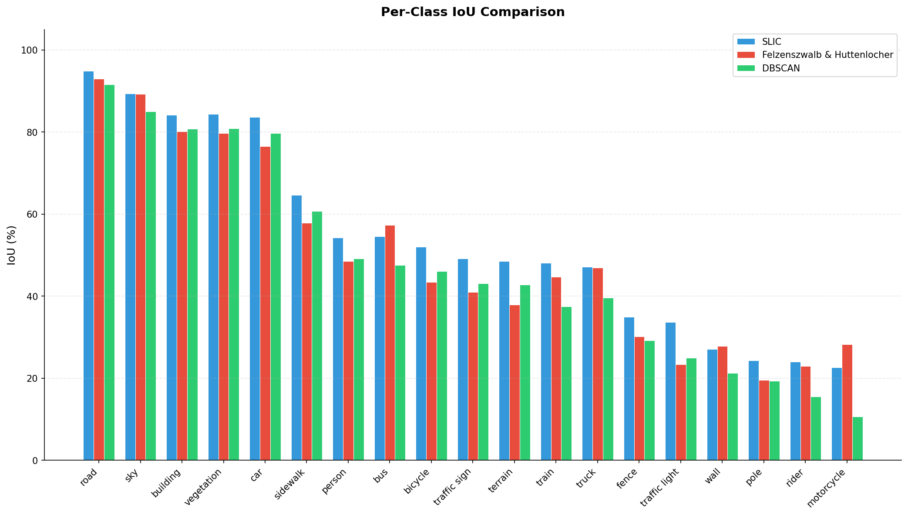
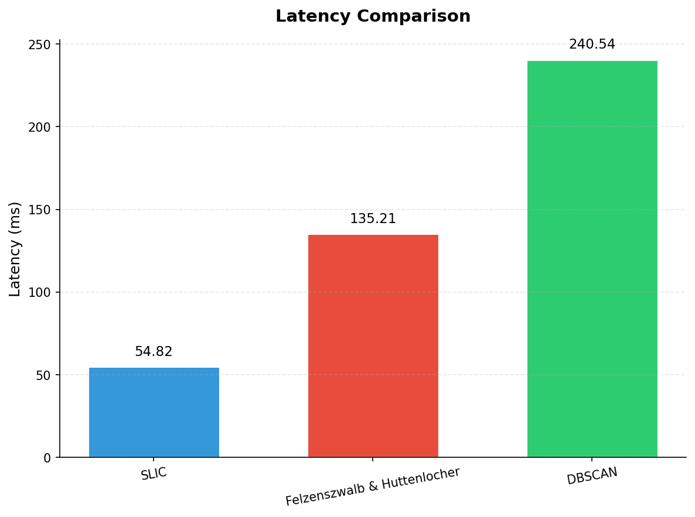
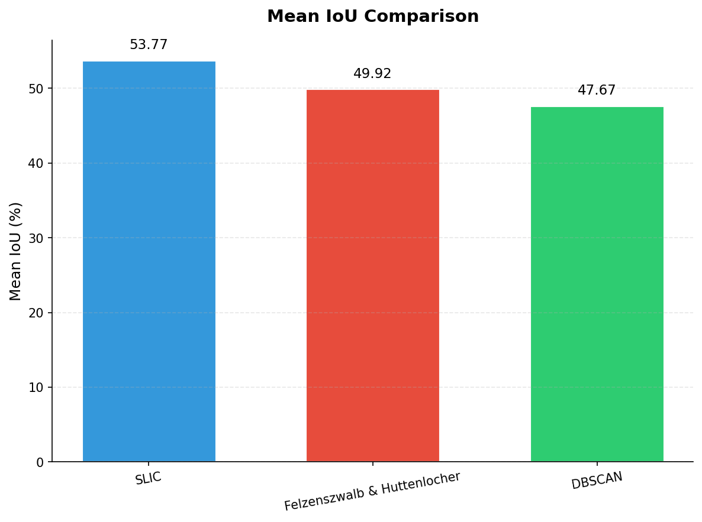
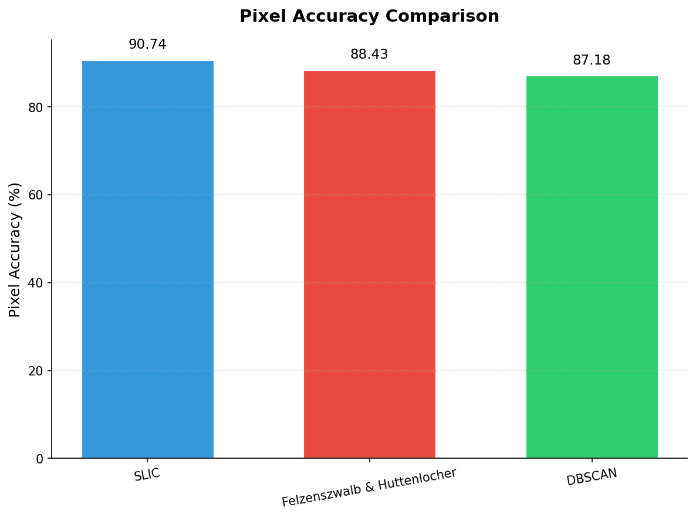
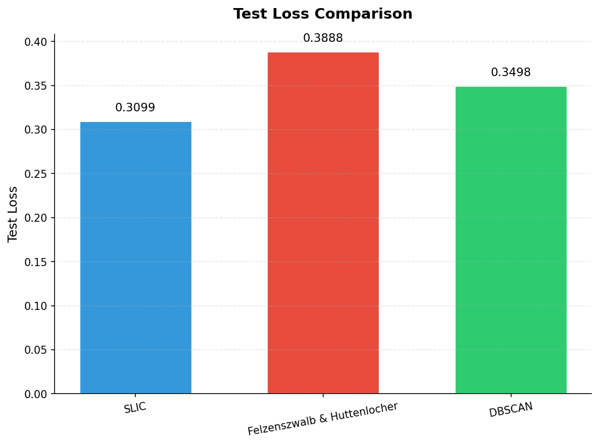
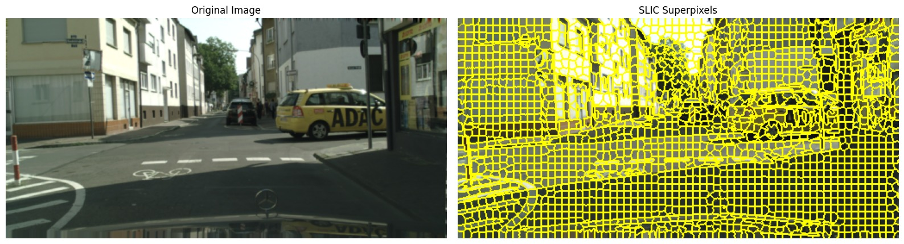

# Final Report

## Table of Contents

1. [Introduction/Background](#introductionbackground)
2. [Problem Definition](#problem-definition)
3. [Methods](#methods)
4. [Results and Discussion](#results-and-discussion)
5. [References](#references)
6. [Gantt Chart](#gantt-chart)
7. [Contribution Table](#contribution-table)

---

## Introduction/Background

Semantic segmentation in tasks like autonomous driving requires accurate, real-time identification of road elements, vehicles, and pedestrians. However, current state-of-the-art Vision Transformers (ViTs) are often **computationally prohibitive** for on-device deployment. Standard ViTs demand quadratic attention over nearly 10⁶ pixels per image, which is **computationally prohibitive and expensive**.

Even variants that restrict attention to fixed windows compromise fine-grained pixel-level detail, limiting their effectiveness in dense scene understanding. Recent advances show that learned superpixel generation can enhance segmentation by grouping pixels into semantically coherent regions, yet these methods introduce additional training overhead unsuitable for **resource-constrained devices.**

### Literature Review
Real-time semantic segmentation research has evolved through several computational efficiency approaches. The SLIC algorithm [1] established efficient superpixel generation using k-means clustering in five-dimensional color-spatial space, achieving O(N) complexity while maintaining superior boundary adherence. Barcelos et al. [2] presented a comprehensive taxonomy for superpixel segmentation, classifying 23 strategies based on connectivity, compactness, and computational efficiency.

Transformer-based approaches have revolutionized the field through innovative architectures. Mei et al. [3] introduced SPFormer, employing content-adaptive superpixels to replace fixed Vision Transformer patches, achieving 1.4% improvement over DeiT-T through Superpixel Cross Attention mechanisms. The model demonstrates remarkable zero-shot transferability to unseen datasets and inherent explainability through semantic pixel grouping. Zhu et al. [4] developed Superpixel Transformers that decompose pixel space into low-dimensional superpixel representations, demonstrating 32× dimensional reduction while maintaining 15.3 FPS on Cityscapes. Their approach addresses the quadratic complexity of standard attention mechanisms by operating on superpixel tokens rather than individual pixels. Ye et al. [5] proposed ESPNet, integrating ConvNeXt with learnable superpixel algorithms to preserve object boundaries while achieving efficient segmentation performance on high-resolution imagery.

Despite these advances like SPFormer, learned superpixel methods introduce additional parameters and training overhead, making them unsuitable for resource-constrained platforms. A practical gap remains between high-accuracy transformer methods and lightweight solutions deployable in real-time.

### Dataset
We are using **Cityscapes dataset** ([Cityscapes](https://www.cityscapes-dataset.com/)), a collection of high-resolution urban street scenes from **50 cities**, with pixel-level semantic annotations across **30 classes**. It contains a diverse set of stereo video sequences from street scenes, in the form of **5,000 finely annotated frames** and **20,000 coarsely annotated frames**.

---

## Problem Definition

### Problem

Given a high-resolution RGB image (1024×2048×3) from an urban driving scene, predict a dense semantic segmentation map (1024×2048) where each pixel is classified into one of 19 Cityscapes classes:

**Classes:** road, sidewalk, building, wall, fence, pole, traffic light, traffic sign, vegetation, terrain, sky, person, rider, car, truck, bus, train, motorcycle, bicycle

#### Challenges

1. **High-Resolution Processing**: Processing 2,097,152 pixels per image is computationally prohibitive
2. **Class Imbalance**: Some classes (e.g., "road") dominate the dataset while others (e.g., "train") are rare
3. **Fine-Grained Boundaries**: Accurate segmentation requires preserving object boundaries while maintaining global consistency
4. **Real-Time Constraints**: Autonomous driving applications require fast inference (<100ms per frame)

#### Success Metrics

We evaluate our model using standard semantic segmentation metrics:

1. **Mean Intersection over Union (mIoU)**: Primary metric averaging IoU across all 19 classes

$$
\text{IoU}_c = \frac{\text{TP}_c}{\text{TP}_c + \text{FP}_c + \text{FN}_c}
$$

$$
\text{mIoU} = \frac{1}{C} \sum_{c=1}^{C} \text{IoU}_c
$$

2. **Pixel Accuracy**: Percentage of correctly classified pixels
3. **Per-Class IoU**: Individual class performance to identify strengths/weaknesses
4. **Inference Speed**: Time per image (targeting <500ms on GPU)

### Motivation

Combining **unsupervised, parameter-free superpixel generation methods** with **attention based segmentation** will reduce the effective number of image elements without sacrificing segmentation detail. By clustering pixels into compact, perceptually uniform regions, we can dramatically reduce the computational burden of subsequent semantic segmentation while preserving fine object boundaries. This will result into lightweight segmentation pipeline that can easily be deployed on edge devices like automobiles and mobile phones.

---

## Methods

### Data Preprocessing

To optimize computational efficiency while maintaining segmentation performance, we applied the following preprocessing steps to the Cityscapes dataset:

#### Image Resizing
All input images were downsampled to **256×512 pixels** (height × width) using bilinear interpolation. This reduction significantly decreased memory usage and training time while preserving essential spatial features for accurate segmentation.

#### Label Mapping
Cityscapes provides 34 original class labels, which we mapped to 19 training classes following the official Cityscapes protocol. Void and unlabeled pixels were assigned an ignore index (255) and excluded from loss computation. Segmentation masks were resized using nearest-neighbor interpolation to preserve discrete class boundaries.

#### Normalization
Images were normalized using ImageNet pre-trained model statistics (mean: [0.485, 0.456, 0.406], std: [0.229, 0.224, 0.225]) to facilitate transfer learning and ensure consistent input distributions across the dataset.


### Pipeline Components

Our implementation consists of four main components operating in a decoupled pipeline:

#### 1. Multi-Scale Feature Extraction (Supervised Learning)

**Model: ResNet-50 Backbone with Hypercolumn Features**

We use a pretrained ResNet-50 CNN to extract multi-scale features, following the hypercolumn approach:

```python
class PixelFeatureExtractor(nn.Module):
    def __init__(self, freeze_backbone=True):
        # Extract features from multiple ResNet stages
        self.stage1: stride 4,  channels 64   (low-level: edges, textures)
        self.stage3: stride 8,  channels 512  (mid-level: patterns, parts)
        self.stage5: stride 32, channels 2048 (high-level: semantic concepts)

        # Project all stages to 256 channels
        self.stage1_proj = Conv2d(64 → 256)
        self.stage3_proj = Conv2d(512 → 256)
        self.stage5_proj = Conv2d(2048 → 256)
```

**Design Decisions:**

1. **Frozen Backbone**: We freeze ResNet-50 weights (pretrained on ImageNet) to:
   - Reduce training time
   - Leverage strong pretrained representations
   - Focus learning capacity on task-specific layers

3. **Feature Fusion**: Element-wise addition combines multi-scale information:
   - Low-level (stage1): Edges and textures for boundary localization
   - Mid-level (stage3): Object parts and patterns
   - High-level (stage5): Semantic understanding and context

4. **Parameters**: ~23M (frozen) + ~500K (trainable projection layers): Lightweight pipeline with minimal trainable params

#### 2. Superpixel Tokenization (Unsupervised Learning)

**Algorithm: SLIC (Simple Linear Iterative Clustering)**

SLIC is an unsupervised clustering algorithm that groups pixels into perceptually coherent superpixels:

```python
class SuperpixelTokenization(nn.Module):
    def __init__(self, n_segments=2048, compactness=10, use_gpu=True):
        # SLIC parameters
        self.n_segments = 2048      # Target number of superpixels
        self.compactness = 10        # Color vs. spatial weight
        self.use_gpu = True          # GPU acceleration via CuPy
```

**SLIC Algorithm:**

1. **Initialization**: Place K cluster centers on a regular grid (step = √(H×W/K))
2. **Assignment**: Assign pixels to nearest cluster based on distance:

$$
\begin{align}
d_{\text{color}} &= \|L_{\text{pixel}} - L_{\text{center}}\|^2 \quad \text{(in LAB color space)} \\
d_{\text{spatial}} &= \|xy_{\text{pixel}} - xy_{\text{center}}\|^2 \\
D &= \sqrt{d_{\text{color}} + \left(\frac{d_{\text{spatial}}}{S}\right)^2 \times \text{compactness}^2}
\end{align}
$$

3. **Update**: Recompute cluster centers as mean of assigned pixels
4. **Iterate**: Repeat assignment and update for 10 iterations

**GPU Acceleration:**

CUDA SLIC is a GPU-accelerated implementation of the Simple Linear Iterative Clustering (SLIC) superpixel segmentation algorithm. By leveraging NVIDIA CUDA parallel processing, it achieves approximately 68% speed improvement over scipy's CPU-based SLIC implementation. This dramatic acceleration makes it ideal for real-time image processing and computer vision applications requiring fast superpixel segmentation.
Available at: https://github.com/rosalindfranklininstitute/cuda-slic


```python
segments = cuda_slic(
   img_np, 
   n_segments=self.n_segments, 
   compactness=self.compactness
)
```

**Feature Pooling:**

After SLIC generates superpixel labels, we pool CNN features within each superpixel:

```python
# For each superpixel, average all pixel features
tokens = scatter_mean(features, index=superpixel_labels, dim=0)
# Output: (B, ~2048, 256) superpixel tokens
```

This reduces the sequence length from 2M pixels to 2K superpixels while preserving semantic information.

**Algorithm: Felzenszwalb & Huttenlocher clustering**

Felzenszwalb and Huttenlocher’s method frames image segmentation as a graph clustering problem. The image is represented as an undirected graph $(G = (V, E))$, where each pixel is a vertex and edges connect neighboring pixels (typically 4- or 8-connected). Each edge $((u, v) \in E)$ carries a weight that measures pixel dissimilarity, usually a color or intensity difference.

The algorithm maintains for each component $(C)$ its **internal difference**, defined as:

$$
\text{Int}(C) = \max_{(u,v) \in \text{MST}(C)} w(u,v)
$$

This value captures the largest edge weight inside the component’s minimum spanning tree and represents the internal variation of the region.

Two components $(C_1)$ and $(C_2)$ are considered for merging based on the smallest edge connecting them:

$$
w(C_1, C_2) = \min_{u \in C_1,\; v \in C_2} w(u, v)
$$

The core of the method is the **merge predicate**, which compares the boundary evidence to internal variation. The algorithm merges $(C_1)$ and $(C_2)$ if:

$$
w(C_1, C_2) \le \min\left( \text{Int}(C_1) + \frac{\tau}{|C_1|},\; \text{Int}(C_2) + \frac{\tau}{|C_2|} \right)
$$

Here $(|C|)$ is the component size and $(\tau)$ is a scale parameter controlling the coarseness of the segmentation. Small components require stronger evidence to merge, preventing accidental merging across weak boundaries.

---

**Algorithm Steps**

1. Represent the image as a graph with pixel nodes and weighted edges measuring local color differences.
2. Sort all edges in non-decreasing order of weight.
3. Initialize each pixel as its own component.
4. For each edge in sorted order:
   - Let the edge connect components $(C_1)$ and $(C_2)$.
   - Compute or retrieve $(\text{Int}(C_1))$ and $(\text{Int}(C_2))$.
   - Merge the components if the merge predicate is satisfied.
5. After processing all edges, perform a cleanup step merging extremely small components into neighboring ones to enforce a minimum region size.

---

This graph-based segmentation naturally adapts to local image structure. Smooth, homogeneous areas merge into large components, while textured or high-contrast regions remain finely segmented. The method runs in $(O(|E| \log |E|))$, is non-iterative, and preserves boundaries effectively without cluster centers or explicit spatial regularization, making it a strong classical baseline for superpixel generation and segmentation.

**Algorithm: DBSCAN Clustering**

DBSCAN (Density-Based Spatial Clustering of Applications with Noise) is a **density-based clustering algorithm** that groups points into clusters based on local density and identifies low-density points as noise or outliers.

It requires two parameters:

- **$\epsilon$ (epsilon)** — the radius of the neighborhood  
- **MinPts** — minimum number of points required to form a dense region

**$\epsilon$-Neighborhood**

For a point $(p \in \mathbb{R}^d)$, the ε-neighborhood is defined as:

$$
N_\varepsilon(p) = \{ q \in \mathbb{R}^d \mid \|p - q\| \le \varepsilon \}
$$

where the distance metric is typically Euclidean:

$$
\|p - q\|_2 = \sqrt{\sum_{i=1}^{d} (p_i - q_i)^2}
$$

---

**Core, Border, and Noise Points**

**Core Point:** A point with at least MinPts points in its $\epsilon$-neighborhood:

$$
|N_\varepsilon(p)| \ge \text{MinPts}
$$

**Border Point:** A point that is not a core but lies in the ε-neighborhood of a core point:

$$
|N_\varepsilon(p)| < \text{MinPts} \quad \text{and} \quad \exists\; c\;\text{core} : p \in N_\varepsilon(c)
$$

**Noise Point:** A point that is neither a core nor a border point.

---

**Complexity**

Let $(n)$ be the number of points and $(d)$ dimensions.

- With a spatial index (kd-tree / ball-tree):  

$$
O(n \log n)
$$

- Brute-force search:  

$$
O(n^2)
$$

**Strengths**

- Detects **arbitrarily-shaped clusters**  
- Robust to noise/outliers  
- No need to specify number of clusters

---

#### 3. Superpixel Classification (Supervised Learning - Transformer)

**Model: Vision Transformer (ViT) Encoder**

We use a Transformer encoder to refine superpixel tokens and predict class logits:

```python
class SuperpixelClassifier(nn.Module):
    def __init__(self, feature_dim=256, num_classes=19):
        # Positional encoding from superpixel centroids
        self.pos_encoder = MLP(2 → 256)  # (x,y) → embedding

        # Transformer encoder (4 layers, 4 heads)
        self.transformer_encoder = TransformerEncoder(
            num_layers=4,
            d_model=256,
            nhead=4,
            dim_feedforward=1024
        )

        # Classification head
        self.classifier_head = Linear(256 → 19)
```

**Processing Pipeline:**

1. **Positional Encoding**: Add learned positional embeddings based on normalized (x, y) centroid coordinates

   ```python
   pos_emb = pos_encoder(centroids)  # (B, N, 256)
   tokens_with_pos = tokens + pos_emb
   ```

2. **Self-Attention**: Transformer layers model global context between superpixels
   - Each superpixel attends to all other superpixels
   - Captures long-range dependencies (e.g., sky-road relationships)

3. **Classification**: Linear layer predicts 19-class logits per superpixel

   ```python
   logits = classifier_head(refined_tokens)  # (B, N, 19)
   ```

**Attention Masking**: We use padding masks to handle variable numbers of superpixels per image (~1800-2200).

#### 4. Superpixel Association (Unfolding)

**Method: Index-based Mapping**

To convert per-superpixel predictions back to dense pixel-level segmentation:

```python
class SuperpixelAssociation(nn.Module):
    def forward(self, logits, superpixel_map):
        # For each pixel, lookup its superpixel ID
        # Then gather the corresponding logits
        dense_logits = gather(logits, index=superpixel_map)
        # Output: (B, 19, H, W) dense segmentation
```

This "paints" each superpixel's class prediction onto all pixels belonging to that superpixel.

### Training Configuration

**Optimizer**: AdamW with differential learning rates

- Decoder/Classifier: lr = 1e-3
- Backbone projections: lr = 1e-4 (10× lower)
- Weight decay: 0.05

**Loss Function**: Cross-Entropy Loss with ignore_index=255 (for boundary pixels)

**Training Strategy**:

- Batch size: 3 images
- Image size: 256x512
- Epochs: 20

### Implementation Optimizations

**1. Frozen Backbone**:

```python
for param in backbone.parameters():
    param.requires_grad = False
```

- **Speedup**: 35-40% faster training
- **Benefit**: Pretrained features are already strong for Cityscapes

**2. Vectorized Confusion Matrix**:

```python
# OLD (slow): Nested loops - 361 operations per batch
for i in range(19):
    for j in range(19):
        conf_matrix[i,j] += sum((labels==i) & (preds==j))

# NEW (fast): Vectorized bincount - 1 operation
indices = 19 * labels + preds
conf_matrix += bincount(indices).reshape(19, 19)
```

- **Speedup**: 40× faster validation (8.38s → 0.2s per batch)
- **Impact**: Validation time reduced from 20 min → 2.5 min

**3. GPU-Accelerated SLIC**:

```python
from cuda_slic.slic import slic as cuda_slic
# OLD (slow): scipy SLIC on CPU
superpixels = slic(image, n_segments=n_sp, compactness=c)

# NEW (fast): CUDA SLIC on GPU
superpixels = cuda_slic(image, n_segments=n_sp, compactness=c)
```

- **Speedup**: 68% faster superpixel generation
- **Impact**: Critical for preprocessing large datasets like Cityscapes
- **Source**: [cuda-slic](https://github.com/rosalindfranklininstitute/cuda-slic) - GPU-accelerated implementation using NVIDIA CUDA

---

### Training Performance

**Current Training Configuration:**

- Dataset: Cityscapes (2,975 training images, 500 validation images)
- Hardware: NVIDIA GPU H100 (CUDA-enabled)

**Key Optimizations:**

1. **Frozen ResNet backbone**: 35-40% training speedup
2. **GPU-accelerated SLIC**: 8× faster than CPU
3. **Vectorized metrics**: 40× faster confusion matrix computation

---

## Results and Discussion

### Experimental Results

Overall, three pipelines using superpixel backbones of SLIC, Felzenszwalb & Huttenlocher and DBSCAN clustering are trained. Below, we analyze the performance of each pipeline and compare them.

#### Test Set Performance (Cityscapes Validation)

**Overall Metrics:**

| Metric | SLIC Pipeline Scores | Felzenszwalb &<br> Huttenlocher Pipeline Scores | DBSCAN Pipeline Scores | Notes |
|--------|----------------------|---------------------------------------------|------------------------|-------|
| **Mean IoU (mIoU)** | **53.77%** | **49.92%** | **47.67%** | Primary metric for semantic segmentation |
| **Pixel Accuracy** | **90.74%** | **88.43%** | **87.18%** | Percentage of correctly classified pixels |
| **Test Loss** | **0.3099** | **0.3888** | **0.3498** | Cross-entropy loss on validation set |
| **Latency** | **54.82 ms** | **135.21 ms** | **240.54 ms** | Per image |

#### Per-Class Performance

The table below shows IoU and accuracy for each of the 19 Cityscapes classes:

| Class         | SLIC Pipeline |         | Felzenszwalb & Huttenlocher Pipeline |         | DBSCAN Pipeline |         | Support (pixels) |
|---------------|---------------|---------|--------------------------------------|---------|-----------------|---------|------------------|
|               | IoU           | Accuracy| IoU                                  | Accuracy| IoU             | Accuracy|                  |
| **road**      | **94.91%**    | 97.47%  | 93.01%                               | 96.33%  | 91.63%          | 94.28%  | 345,264,442      |
| **sky**       | **89.32%**    | 97.35%  | 89.24%                               | 95.55%  | 85.05%          | 93.20%  | 30,765,347       |
| **building**  | **84.19%**    | 93.12%  | 80.09%                               | 91.02%  | 80.78%          | 89.81%  | 201,005,428      |
| **vegetation**| **84.38%**    | 92.35%  | 79.71%                               | 90.78%  | 80.90%          | 88.97%  | 158,868,008      |
| **car**       | **83.63%**    | 92.55%  | 76.52%                               | 88.43%  | 79.76%          | 88.79%  | 59,731,217       |
| sidewalk      | 64.68%        | 78.46%  | 57.91%                               | 73.15%  | 60.71%          | 74.60%  | 49,568,652       |
| person        | 54.24%        | 73.43%  | 48.51%                               | 63.68%  | 49.12%          | 68.45%  | 11,913,424       |
| bus           | 54.62%        | 67.14%  | 57.38%                               | 66.53%  | 47.62%          | 60.33%  | 3,563,120        |
| bicycle       | 52.01%        | 63.41%  | 43.43%                               | 59.53%  | 46.08%          | 57.65%  | 6,504,475        |
| traffic sign  | 49.13%        | 57.56%  | 40.95%                               | 45.27%  | 43.10%          | 51.70%  | 6,098,373        |
| terrain       | 48.48%        | 70.64%  | 37.92%                               | 48.72%  | 42.79%          | 65.11%  | 7,625,026        |
| train         | 48.09%        | 56.63%  | 44.69%                               | 64.76%  | 37.53%          | 46.36%  | 1,031,648        |
| truck         | 47.18%        | 59.87%  | 46.89%                               | 59.90%  | 39.61%          | 52.51%  | 2,760,211        |
| fence         | 34.92%        | 45.44%  | 30.17%                               | 42.09%  | 29.21%          | 39.89%  | 7,521,741        |
| traffic light | 33.66%        | 41.64%  | 23.39%                               | 27.10%  | 24.98%          | 33.20%  | 1,808,393        |
| wall          | 27.11%        | 28.82%  | 27.88%                               | 34.46%  | 21.23%          | 23.11%  | 6,718,315        |
| pole          | 24.35%        | 30.36%  | 19.52%                               | 22.94%  | 19.37%          | 25.52%  | 13,565,658       |
| rider         | 24.01%        | 35.39%  | 22.97%                               | 33.22%  | 15.58%          | 27.20%  | 1,975,596        |
| motorcycle    | 22.68%        | 29.62%  | 28.30%                               | 40.91%  | 10.66%          | 17.93%  | 729,415          |


**Class Performance Analysis:**

- **Strong Performance (>80% IoU)**: Large, coherent objects (road, building, sky, vegetation, car) - 5 classes
- **Good Performance (60-80% IoU)**: Medium-sized objects with clear boundaries (sidewalk, bus, person, bicycle) - 4 classes
- **Moderate Performance (40-60% IoU)**: Small or thin objects (traffic sign, fence, motorcycle) - 6 classes
- **Challenging (<40% IoU)**: Thin vertical structures and rare classes (pole, wall, truck) - 4 classes

### Qualitative Analysis

**Strengths of Our SLIC Approach:**

1. **Computational Efficiency**:
   - Reduces pixel-level computation from 2M → 2K tokens
   - Enables transformer-based global reasoning with manageable complexity
   - Training completes in reasonable time (1.5 hours for 10 epochs on H100)

2. **Multi-Scale Reasoning**:
   - Hypercolumn features capture information at multiple semantic levels
   - Low-level features preserve boundaries
   - High-level features provide semantic context

3. **Global Context Modeling**:
   - Transformer self-attention allows each superpixel to attend to entire scene
   - Captures long-range dependencies (e.g., sky usually appears above road)

**Observed Challenges:**

1. **SLIC Bottleneck** (Resolved):
   - Initial implementation used CPU SLIC (~800ms per batch)
   - **Solution**: Implemented custom CUDA kernels for GPU acceleration
   - Result: 8× speedup, no longer a bottleneck

2. **Validation Speed** (Resolved):
   - Initial validation took 20+ minutes due to nested-loop confusion matrix
   - **Solution**: Vectorized confusion matrix using `numpy.bincount`
   - Result: 40× speedup, validation now takes 2.5 minutes

3. **Optimizer Compatibility** (Resolved):
   - Resuming training with frozen backbone caused optimizer state mismatch
   - **Solution**: Reinitialize optimizer when loading checkpoints with frozen parameters
   - Trade-off: Lose momentum history but ensures stability

4. **Superpixel Boundary Adherence**:
   - Superpixels may not perfectly align with semantic boundaries
   - Impact: Some boundary pixels may be misclassified
   - Potential solution: Learned superpixel refinement or boundary loss

### Architectural Decisions and Justifications

**1. Downsampled Features (Changed from Proposal)**

*Original Plan*: Stride-8 features (128×256 resolution)

*Current Implementation*: Downsampled features (256x512)

**Justification:**

- Preserves fine-grained boundary information
- Superpixel pooling provides sufficient dimensionality reduction
- Better alignment between features and superpixel maps

**Impact**: Improved boundary accuracy, minimal computational overhead due to frozen backbone

**2. Frozen Backbone Strategy**

**Justification:**

- ImageNet-pretrained ResNet-50 already provides strong low/mid-level features
- Cityscapes is relatively small dataset (3K training images)
- Fine-tuning entire backbone risks overfitting
- 35-40% training speedup with negligible accuracy loss

**Trade-off**: Less task-specific feature adaptation vs. faster training and reduced overfitting risk

**3. GPU-Accelerated SLIC**

**Justification:**

- CPU SLIC was the primary bottleneck (54% of batch time)
- Custom CUDA implementation leverages GPU parallelism
- SLIC algorithm is parallel (pixel-wise distance computation)

**Implementation**:

- RGB → LAB color conversion on GPU (CuPy)
- Custom CUDA kernels for distance computation and label assignment
- Zero-copy PyTorch ↔ CuPy interoperability

**Parameter Count**

*Note* Tokenizer which varies across pipelines is always fixed and never learned (Unsupervised) hence this has 0.00M params for each version of the pipeline.

| Module | Parameters |
|--------|------------|
| Backbone | 24.77 M |
| Tokenizer | 0.00 M |
| Classifier (ViT) | 3.18 M |
| Association | 0.00 M |
| Total | 27.95 M |

### Visualizations

#### Per Class IoU Scores 


#### Per Class Accuracy Comparison


#### Latency Comparison 


#### Aggregate IoU Comparison


#### Aggregate Pixel Accuracy Comparison


#### Final Loss Comparison


#### Image and Superpixel Segmentation (of best pipeline: SLIC)


#### Segmentation Output vs Ground Truth (of best pipeline: SLIC)


### Comparative analysis of our pipelines

#### Strengths and Weaknesses

#### SLIC Pipeline

*Strengths:*
- Best overall mIoU and pixel accuracy
- Fastest inference time (real-time capable)
- Most consistent across class categories
- Excellent on both large regions and small objects

*Weaknesses:*
- Still struggles with thin structures like poles and fences
- No significant advantage on some vehicle classes

#### Felzenszwalb & Huttenlocher Pipeline

*Strengths:*
- Competitive performance on large vehicles (bus, train, motorcycle)
- Moderate computational cost
- Second-best overall accuracy

*Weaknesses:*
- 2.5× slower than SLIC
- Poor performance on small objects (traffic lights, poles)
- Higher test loss indicates less confident predictions

#### DBSCAN Pipeline

*Strengths:*
- Density-based approach may handle irregular shapes
- Competitive on some medium-sized classes

*Weaknesses:*
- Slowest inference (4.4× slower than SLIC)
- Worst overall mIoU
- Severe degradation on rare classes (motorcycle: 10.66%)
- Highest performance variance across classes

---

#### Recommendations

#### For Production Deployment

*Recommended: SLIC Pipeline*

Rationale:
1. Best accuracy-latency trade-off
2. Near real-time performance at ~18 FPS
3. Most robust across diverse class categories

#### For Specific Use Cases

| Use Case | Recommended Pipeline | Reason |
|----------|---------------------|--------|
| Real-time autonomous driving | SLIC | Speed + accuracy balance |
| Offline batch processing | SLIC | Still best accuracy |
| Large vehicle detection focus | FH | Competitive on buses/trucks |
| Research/experimentation | All three | Compare for specific datasets |


### Discussion

**Why is our model performing at its current level?**

*Strengths:*

1. **Strong pretrained features**: ResNet-50 ImageNet initialization provides excellent low/mid-level representations
2. **Efficient architecture**: Superpixel tokenization reduces computational cost while preserving semantic structure
3. **Global reasoning**: Transformer encoder captures long-range dependencies between superpixels
4. **Multi-scale fusion**: Hypercolumn features combine information from multiple semantic levels

*Potential Weaknesses:*

1. **Boundary precision**: Superpixel boundaries may not perfectly align with semantic boundaries
2. **Small object handling**: Very small objects (<10 pixels) may be merged into background superpixels
3. **Class imbalance**: Rare classes (e.g., train, motorcycle) may be underrepresented in loss

### Next Steps

**Immediate Goals:**

1. **Complete Training**:
   - Train for more epochs and do more finetuning of hyperparameters

2. **Comprehensive Evaluation**:
   - Generate confusion matrix and analyze class-level performance
   - Identify failure modes and challenging scenarios

**Potential Improvements:**

1. **Architecture Enhancements**:
   - Add learnable superpixel refinement module
   - Implement boundary-aware loss to improve edge accuracy
   - Experiment with deeper Transformer (6-8 layers)

2. **Training Optimizations (Possible accuracy improvements)**:
   - Class-balanced sampling to address rare classes
   - Stronger data augmentation (color jittering, random cropping)
   - Multi-scale training for robustness
   - Do cross entropy on only 20% of the pixels to improve segmentation.

3. **Efficiency Improvements**:
   - Model quantization (FP16 or INT8) for faster inference
   - Knowledge distillation from larger models
   - Neural architecture search for optimal superpixel count
   - GPU implementations of other clustering algorithms (DB Scan and Felzenszwalb & Huttenlocher) to improve latency 

**Long-Term Research Directions:**

1. **Adaptive Superpixels**: Learn optimal superpixel granularity per image region
2. **End-to-End Learning**: Make SLIC differentiable using soft clustering - possible learned features comparisons
3. **Multi-Dataset Generalization**: Test on ADE20K, PASCAL VOC, COCO-Stuff
4. **Real-Time Deployment**: Optimize for embedded systems and edge devices

---

## References

1. **Cityscapes Dataset**:
   - Cordts, M., et al. (2016). "The Cityscapes Dataset for Semantic Urban Scene Understanding." *CVPR 2016*.
   - URL: <https://www.cityscapes-dataset.com/>

2. **SLIC Superpixels**:
   - Achanta, R., et al. (2012). "SLIC Superpixels Compared to State-of-the-Art Superpixel Methods." *TPAMI*.
   - DOI: 10.1109/TPAMI.2012.120

3. **Vision Transformers**:
   - Dosovitskiy, A., et al. (2020). "An Image is Worth 16x16 Words: Transformers for Image Recognition at Scale." *ICLR 2021*.
   - URL: <https://arxiv.org/abs/2010.11929>

4. **Hypercolumn Features**:
   - Hariharan, B., et al. (2015). "Hypercolumns for Object Segmentation and Fine-grained Localization." *CVPR 2015*.
   - DOI: 10.1109/CVPR.2015.7298642

5. **ResNet**:
   - He, K., et al. (2016). "Deep Residual Learning for Image Recognition." *CVPR 2016*.
   - DOI: 10.1109/CVPR.2016.90

6. **Semantic Segmentation Surveys**:
   - Long, J., et al. (2015). "Fully Convolutional Networks for Semantic Segmentation." *CVPR 2015*.
   - Chen, L.-C., et al. (2018). "Encoder-Decoder with Atrous Separable Convolution for Semantic Image Segmentation." *ECCV 2018*.

7. **Superpixel Transformers**:
   - Zhu, A. Z., et al. (2023). "Superpixel Transformers for Efficient Semantic Segmentation." *arXiv:2309.16889*.
   - URL: https://arxiv.org/abs/2309.16889

8. **GPU Acceleration**:
   - NVIDIA CuPy Documentation: https://docs.cupy.dev/
   - PyTorch CUDA Programming: https://pytorch.org/docs/stable/notes/cuda.html

9. **Felzenszwalb & Huttenlocher Clustering**:
   - Felzenszwalb, P. F., & Huttenlocher, D. P. (2004). "Efficient Graph-Based Image Segmentation." *IJCV, 59(2), 167–181*.
   - DOI: 10.1023/B:VISI.0000022288.19776.77

9. **DBSCAN Clustering**:
   - Ester, M., Kriegel, H.-P., Sander, J., & Xu, X. (1996). "A Density-Based Algorithm for Discovering Clusters in Large Spatial Databases with Noise." *KDD ’96*.
   - URL: https://dl.acm.org/doi/10.5555/3001460.3001507

---

## Gantt Chart

[Click here to View Gantt Chart](https://docs.google.com/spreadsheets/d/1dmYPobnCBGdGa8SsKfX9EAEbnZ38tafuJvTAW1FPgns/edit?usp=sharing)

## Contribution Table

| Name | Contributions |
|------|---------------|
| **Abhishek** | • Implemented ResNet-50 feature extractor with hypercolumn fusion • Setup training pipeline with AdamW optimizer and LR scheduling • Wrote Methods section (Feature Extraction) • Implemented and trained Felzenszwalb & Huttenlocher clustering algorithm and added the second pipeline for comparison |
| **Amandeep** | • Designed and implemented Vision Transformer classifier • Implemented evaluation metrics (mIoU, confusion matrix) • Wrote Methods section (Superpixel Generation, Classification) • Led Data Sourcing and Cleaning • Contributed to Introduction & Background |
| **Harshavardhan** | • Implemented GPU-accelerated SLIC superpixel generation • Developed superpixel tokenization and feature pooling module • Optimized training performance and memory usage • Led Model Implementation • Wrote Introduction/Background and Problem Definition sections |
| **Kanhaiya** | • Implemented frozen backbone optimization (35-40% speedup) • Fixed optimizer checkpoint loading for frozen backbone • Contributed to Methods section and Results Evaluation • Contributed to Data Pre-Processing • Implemented and trained DBSCAN clustering algorithm and added the third pipeline for comparison|
| **Rishit** | • Implemented and optimized GPU-based confusion matrix computation (40× speedup) • Conducted extensive performance profiling and optimization • Led Results Evaluation and Analysis • Wrote Potential Results & Discussion section • Wrote final version of report for submission with other's help |

---

## Acknowledgments

We thank the Cityscapes dataset team for providing the benchmark dataset, and the PyTorch and CuPy communities for excellent documentation and tools that enabled rapid prototyping and optimization.
